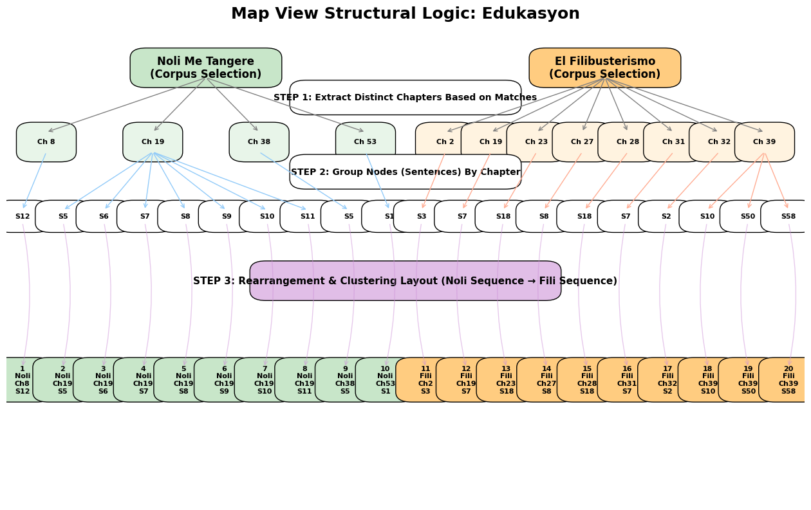
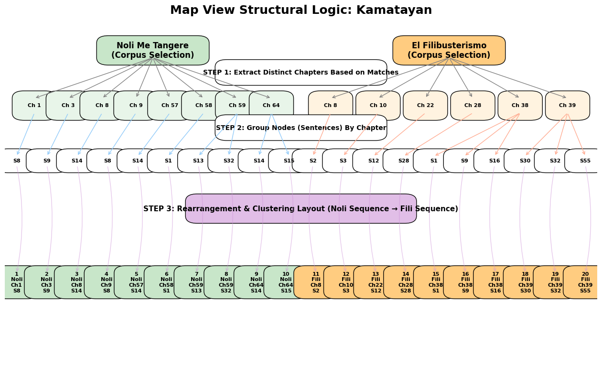
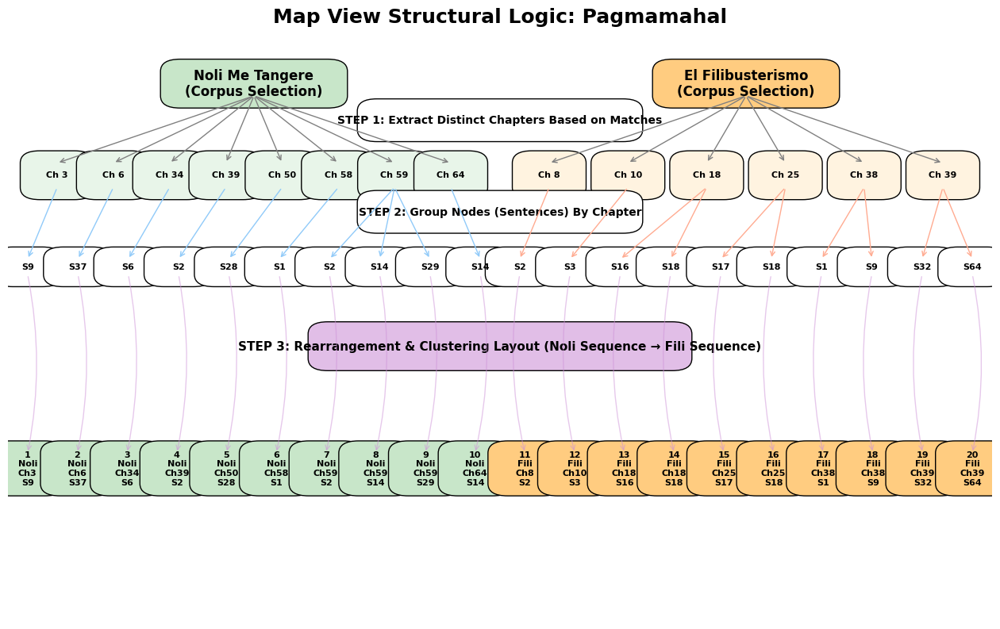

# Underlying Search Engine Calculation (Shared Logic)

Before any chapters or nodes are plotted on the Map View diagrams, they are computed through a shared backend search pipeline identical to the system's standard grid view. The Map View does not calculate independent relevance or context windows; instead, it inherits the fully processed output of this multi-stage engine:

1. **Dual-Model Embedding**: Queries are encoded using both a universal base *XLM-RoBERTa* model and a custom Domain-Adapted Pre-Trained (*DAPT*) model fine-tuned on Rizal's Tagalog corpus. This hybrid embedding balances general semantic meaning with domain-specific contextual nuances.
2. **Hybrid Scoring Pipeline**: Candidate sentences are evaluated using a combined approach: **Lexical Scoring** measures strict keyword density and exact phrasing overlaps, while **Semantic Scoring** calculates the vector cosine similarity distance between the dual-embedded query and the sentence representations.
3. **Component-Weighted Precision (CWPR)**: For complex themes, the engine decomposes the query into logical roles and calculates a strict geometric mean of similarities across all components. This ensures retrieved nodes address the entire thematic concept rather than partial subsets.
4. **Fixed Context Expansion**: Instead of generating dynamic context during the Map rendering, the backend maps the exact anchor sentence back to its fixed position in the database. It then automatically extracts adjacent indices (e.g., `sentence ± 2`) directly. The map interface merely visualizes this pre-calculated context window.

*(These exact hybrid calculations dictate the raw candidate pool that is subsequently selected, grouped, and rearranged in the structural diagrams below).*

---

# Edukasyon



### Diagram Explanation
- **Chapter Selection:** Chapters containing relevant sentence matches for "edukasyon" were identified from both disjoint corpuses: 4 chapters from *Noli Me Tangere* (8, 19, 38, 53) and 8 chapters from *El Filibusterismo* (2, 19, 23, 27, 28, 31, 32, 39). 
- **Node Grouping:** Node matches were batched spatially by their parent chapters. Notably, Chapter 19 of *Noli* clustered high thematic density with 7 distinct sentence nodes, while Chapter 39 of *Fili* clustered 3.
- **Theme Rearrangement:** Regardless of semantic density or relevancy score, the layout strictly restructured the raw query matches to align logically with the narrative timeline. The final map flattens the hierarchy, locking Noli matching nodes sequentially (Ascending: Ch 8 → Ch 53), immediately followed by Fili matching nodes (Ascending: Ch 2 → Ch 39).
- **Shared Dataset & Calculation:** The map layout uses the exact same underlying calculations and search engine results as the standard Grid View. It does not execute a separate search query or context computation; instead, it relies entirely on the shared result dataset and simply reorganizes it into this chronological map layout.


# Kamatayan



### Diagram Explanation
- **Chapter Selection:** Matches for "kamatayan" were dispersed heavily towards the climaxes. Extracted chapters included *Noli* (1, 3, 8, 9, 57, 58, 59, 64) and *Fili* (8, 10, 22, 28, 38, 39).
- **Node Grouping:** The clustering logic groups multiple sentence matches together under single structural headers, primarily observed in late chapters: *Noli* Ch 59 (2 nodes), *Noli* Ch 64 (2 nodes), *Fili* Ch 38 (3 nodes), and *Fili* Ch 39 (3 nodes).
- **Theme Rearrangement:** The restructuring visually forms a bridge from the earlier novel to the latter. Instead of dispersing matches based on confidence score, the Map lays out a literal roadmap: starting with the execution references in the very first chapter of *Noli* (Node 1) all the way sequentially up to the tragic conclusions of *Fili* Chapter 39 (Node 20).
- **Shared Dataset & Calculation:** The map layout uses the exact same underlying calculations and search engine results as the standard Grid View. It does not execute a separate search query or context computation; instead, it relies entirely on the shared result dataset and simply reorganizes it into this chronological map layout.


# Pagmamahal



### Diagram Explanation
- **Chapter Selection:** "Pagmamahal" yielded strong selections isolated among key interaction chapters. For *Noli*, 8 unique chapters were pulled (3, 6, 34, 39, 50, 58, 59, 64) and for *Fili*, 6 unique chapters were retrieved (8, 10, 18, 25, 38, 39).
- **Node Grouping:** Sentence nodes were spatially binned with strong density groupings in *Noli* Ch 59 (3 clustered sentences) and pairs found in *Fili* Ch 18, Ch 25, and Ch 38.
- **Theme Rearrangement:** The final sequence entirely decouples query score from ordering. The structural rearrangement simply threads the concept chronologically across the unified corpus. The layout shifts evenly from *Noli* node 1 (Ch 3, S9) across the transition point at node 10 (Ch 64, S14) directly into *El Filibusterismo* node 11 (Ch 8, S2), visually mapping the progression of the concept across Rizal's two books.
- **Shared Dataset & Calculation:** The map layout uses the exact same underlying calculations and search engine results as the standard Grid View. It does not execute a separate search query or context computation; instead, it relies entirely on the shared result dataset and simply reorganizes it into this chronological map layout.


---

# Map View Structural Diagram Generation Code

The following Python script systematically generated the visualization logic required to translate raw clustered data into the sequential sequence expected by the Map View requirements.

```python
import matplotlib.pyplot as plt
import matplotlib.patches as patches
import os

def create_diagram(title, noli, fili, filename):
    fig, ax = plt.subplots(figsize=(16, 10))
    ax.axis('off')
    
    plt.text(0.5, 0.98, f"Map View Structural Logic: {title}", fontsize=18, fontweight='bold', ha='center')
    
    def add_box(x, y, text, w=0.04, h=0.04, color="#eee", fontsize=8):
        box = patches.FancyBboxPatch((x - w/2, y - h/2), w, h, boxstyle="round,pad=0.02", 
                                     edgecolor='black', facecolor=color, lw=1)
        ax.add_patch(box)
        ax.text(x, y, text, ha='center', va='center', fontsize=fontsize, fontweight='bold')
        return (x, y - h/2), (x, y + h/2)

    # 1. Novels Layer
    noli_btm, _ = add_box(0.25, 0.88, "Noli Me Tangere\n(Corpus Selection)", w=0.15, h=0.04, color="#c8e6c9", fontsize=12)
    fili_btm, _ = add_box(0.75, 0.88, "El Filibusterismo\n(Corpus Selection)", w=0.15, h=0.04, color="#ffcc80", fontsize=12)
    
    noli_chaps = {}
    for ch, sent in noli: noli_chaps.setdefault(ch, []).append(sent)
    fili_chaps = {}
    for ch, sent in fili: fili_chaps.setdefault(ch, []).append(sent)
    
    noli_sorted_chaps = sorted(noli_chaps.keys())
    fili_sorted_chaps = sorted(fili_chaps.keys())
    
    # 2. Chapters Selection Layer
    add_box(0.5, 0.82, "STEP 1: Extract Distinct Chapters Based on Matches", w=0.25, h=0.03, color="#fff", fontsize=10)
    
    noli_chap_pts = {}
    for i, ch in enumerate(noli_sorted_chaps):
        # Evenly space chapter nodes across the Noli section
        x = 0.05 + 0.40 * (i / max(1, len(noli_sorted_chaps)-1)) if len(noli_sorted_chaps) > 1 else 0.25
        btm, top = add_box(x, 0.73, f"Ch {ch}", color="#e8f5e9", w=0.035)
        ax.annotate("", xy=top, xytext=noli_btm, arrowprops=dict(arrowstyle="->", color="gray"))
        noli_chap_pts[ch] = btm
        
    fili_chap_pts = {}
    for i, ch in enumerate(fili_sorted_chaps):
        # Evenly space chapter nodes across the Fili section
        x = 0.55 + 0.40 * (i / max(1, len(fili_sorted_chaps)-1)) if len(fili_sorted_chaps) > 1 else 0.75
        btm, top = add_box(x, 0.73, f"Ch {ch}", color="#fff3e0", w=0.035)
        ax.annotate("", xy=top, xytext=fili_btm, arrowprops=dict(arrowstyle="->", color="gray"))
        fili_chap_pts[ch] = btm
        
    # 3. Sentences Grouped
    add_box(0.5, 0.67, "STEP 2: Group Nodes (Sentences) By Chapter", w=0.25, h=0.03, color="#fff", fontsize=10)
    noli_sents_flat = [(ch, s) for ch in noli_sorted_chaps for s in sorted(noli_chaps[ch])]
    fili_sents_flat = [(ch, s) for ch in fili_sorted_chaps for s in sorted(fili_chaps[ch])]
    
    noli_sent_pts = []
    for i, (ch, s) in enumerate(noli_sents_flat):
        x = 0.02 + 0.46 * (i / max(1, len(noli_sents_flat)-1)) if len(noli_sents_flat) > 1 else 0.25
        btm, top = add_box(x, 0.58, f"S{s}", w=0.03, h=0.025, color="white", fontsize=8)
        # Link grouped sentences structurally to parent chapters
        ax.annotate("", xy=top, xytext=noli_chap_pts[ch], arrowprops=dict(arrowstyle="->", color="#90caf9"))
        noli_sent_pts.append(((ch, s), btm))
        
    fili_sent_pts = []
    for i, (ch, s) in enumerate(fili_sents_flat):
        x = 0.52 + 0.46 * (i / max(1, len(fili_sents_flat)-1)) if len(fili_sents_flat) > 1 else 0.75
        btm, top = add_box(x, 0.58, f"S{s}", w=0.03, h=0.025, color="white", fontsize=8)
        ax.annotate("", xy=top, xytext=fili_chap_pts[ch], arrowprops=dict(arrowstyle="->", color="#ffab91"))
        fili_sent_pts.append(((ch, s), btm))
        
    # 4. Final Ordered Map Sequence
    all_sents = noli_sents_flat + fili_sents_flat
    
    add_box(0.5, 0.45, "STEP 3: Rearrangement & Clustering Layout (Noli Sequence → Fili Sequence)", w=0.35, h=0.04, color="#e1bee7", fontsize=11)
    
    for i, (ch, s) in enumerate(all_sents):
        # Arrange horizontally, completely sequentially
        x = 0.02 + 0.96 * (i / max(1, len(all_sents)-1)) if len(all_sents) > 1 else 0.5
        is_noli = i < len(noli_sents_flat)
        c_color = "#c8e6c9" if is_noli else "#ffcc80"
        tag = "Noli" if is_noli else "Fili"
        _, top = add_box(x, 0.25, f"{i+1}\n{tag}\nCh{ch}\nS{s}", w=0.035, h=0.05, color=c_color, fontsize=8)
        
        # Determine source origin vector to show structural reorganization visually 
        src = noli_sent_pts[i][1] if is_noli else fili_sent_pts[i - len(noli_sents_flat)][1]
        rad = 0.15 if (x > 0.5 and is_noli) else (-0.15 if (x < 0.5 and not is_noli) else (0.1 if x > src[0] else -0.1))
        
        ax.annotate("", xy=top, xytext=src, 
                    arrowprops=dict(arrowstyle="->", color="#ce93d8", alpha=0.5, connectionstyle=f"arc3,rad={rad}"))
                    
    plt.savefig(filename, bbox_inches='tight', dpi=100)
    plt.close()

# Provided Node Dataset Target Tables
edukasyon_noli = [(8,12), (19,6), (19,11), (19,8), (19,5), (19,7), (19,9), (19,10), (38,5), (53,1)]
edukasyon_fili = [(2,3), (19,7), (23,18), (27,8), (28,18), (31,7), (32,2), (39,50), (39,58), (39,10)]

kamatayan_noli = [(1,8), (3,9), (8,14), (9,8), (57,14), (58,1), (59,32), (59,13), (64,14), (64,15)]
kamatayan_fili = [(8,2), (10,3), (22,12), (28,28), (38,9), (38,16), (38,1), (39,30), (39,32), (39,55)]

pagmamahal_noli = [(3,9), (6,37), (34,6), (39,2), (50,28), (58,1), (59,29), (59,2), (59,14), (64,14)]
pagmamahal_fili = [(8,2), (10,3), (18,18), (18,16), (25,17), (25,18), (38,9), (38,1), (39,32), (39,64)]

# Run Generator
create_diagram("Edukasyon", edukasyon_noli, edukasyon_fili, "edukasyon_diagram.png")
create_diagram("Kamatayan", kamatayan_noli, kamatayan_fili, "kamatayan_diagram.png")
create_diagram("Pagmamahal", pagmamahal_noli, pagmamahal_fili, "pagmamahal_diagram.png")
```
