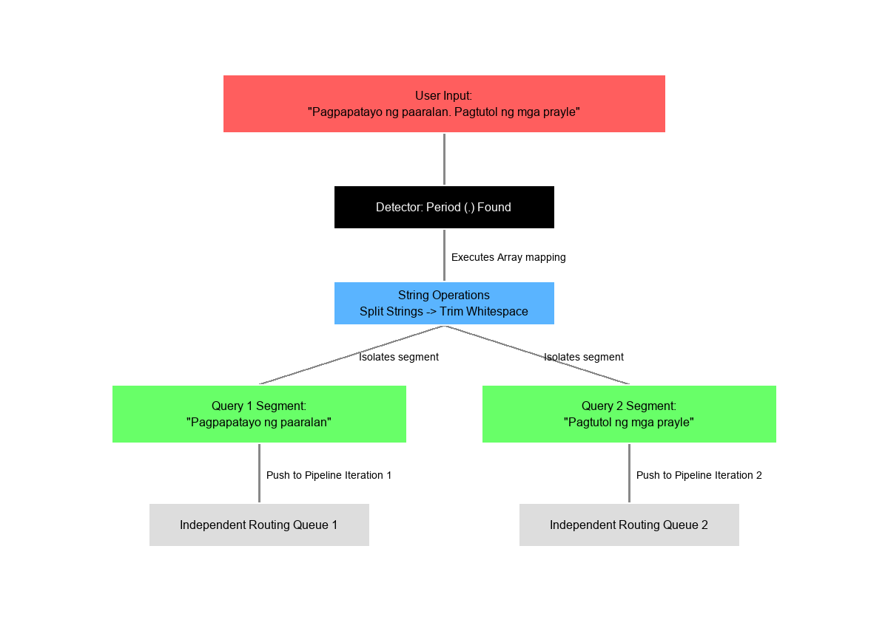
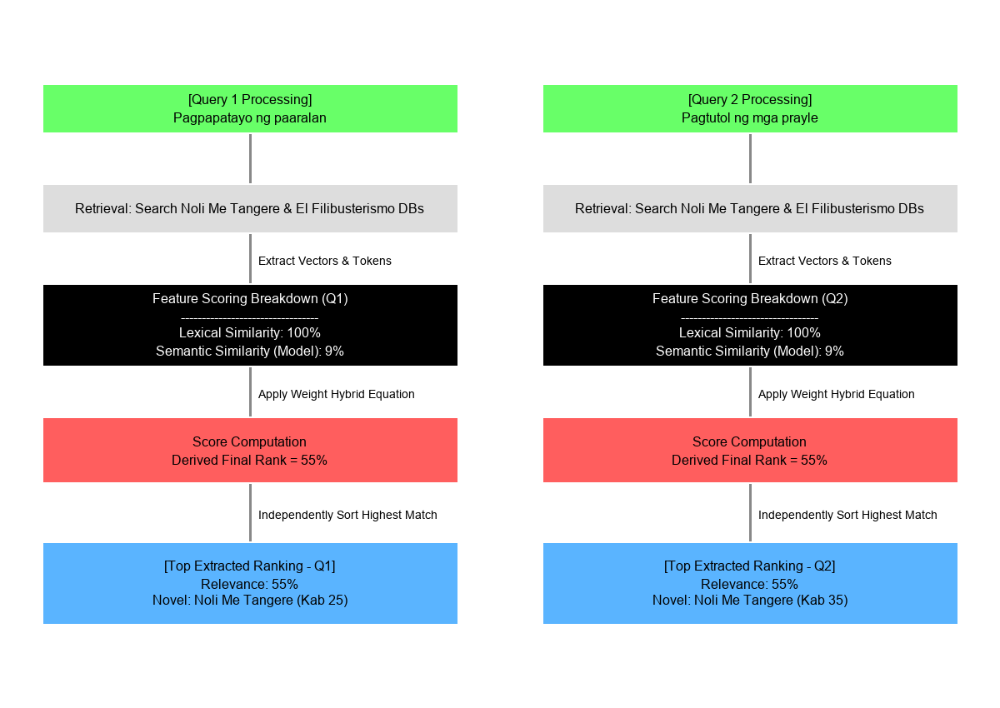
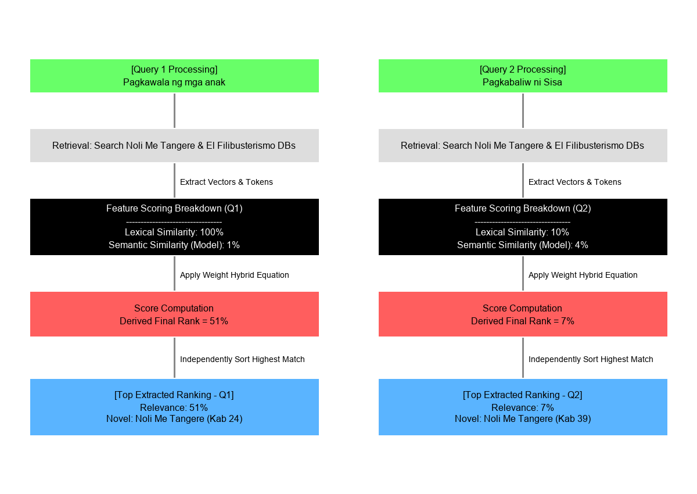
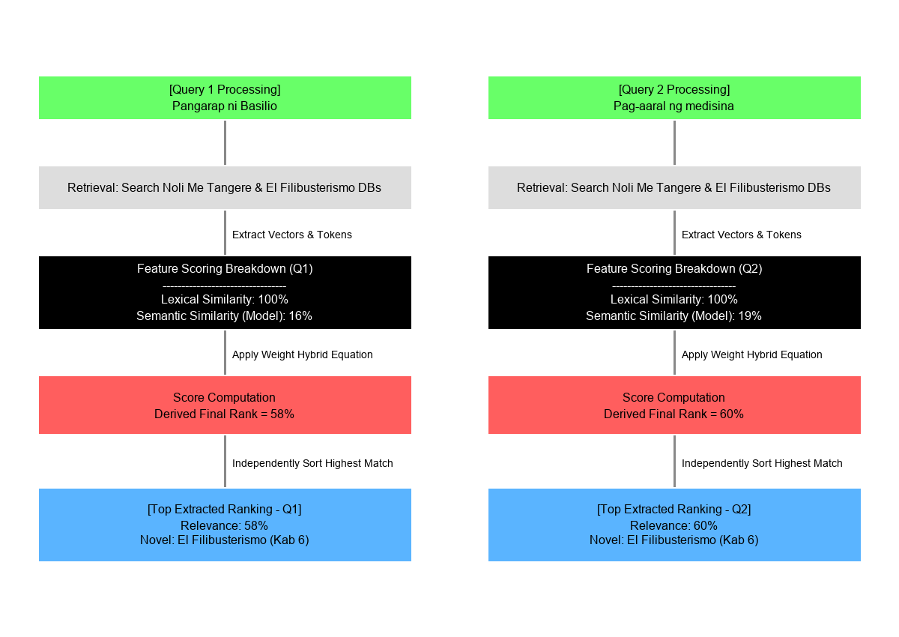
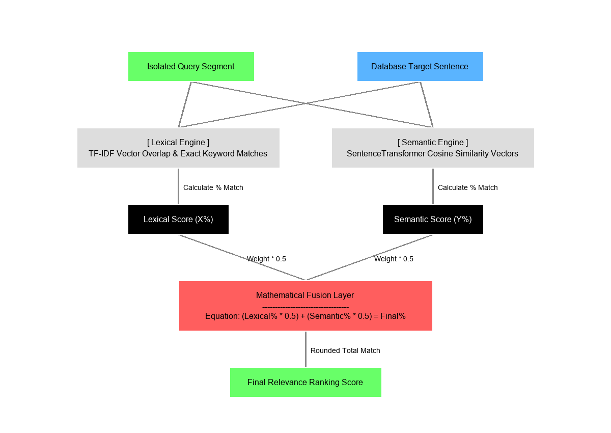

# Technical Integration: The Multi-Sentence Query Feature

## 1. Overview and Rationale
To accommodate complex literary inquiries, the search architecture was extended to support the **Multi-Sentence Query Feature**. Scholars analyzing *Noli Me Tangere* and *El Filibusterismo* frequently explore interconnected concepts spanning causality, character interactions, or opposing themes (e.g., the establishment of a school and the ensuing opposition from the friars). 

By extending the API's input parsing without altering the underlying Hybrid Lexical-Semantic Ranking Engine, the system now allows users to input multiple independent queries simultaneously, separated by a period (`.`).

## 2. Input Parsing and Query Tokenization
The feature operates fundamentally as a preprocessing layer in the search API endpoint. 
1. **Delimiter Detection:** The system detects if the user's input string contains a delimiter (period `.`).
2. **String Splitting:** The payload is tokenized into multiple query segments using the delimiter.
3. **Data Sanitization:** Whitespace is trimmed from each segment. Redundant delimiters (such as `..` creating empty strings) are safely ignored through a validation filter.
4. **Behavioral Continuity:** If no period is detected within the input string, the API bypasses the multi-query array processing and seamlessly executes the existing, standalone single-query execution.

## 3. Independent Execution and Engine Pipeline
Rather than concatenating multiple concepts into a single vector—which often causes concept dilution and reduces the semantic embedding accuracy—the system passes each parsed query segment independently into the embedding engine. 

This ensures that each thought maintains its concentrated lexical weight, TF-IDF keyword overlap, and SentenceTransformer embedding identity without interference from the sibling query.

## 4. Aggregation and Deduplication Latency
Once the engine returns candidate matches sequentially for all queried segments:
- The system initializes state containers for the two novels to aggregate the outputs.
- As results are merged, the logic strictly compares the primary keys (`id`) of the retrieved database `Sentence` objects. 
- Iterating through the arrays, any sentence matching a previously logged ID is discarded. This strict deduplication guarantees that if two queries happen to retrieve the exact same book chapter sentence, the UI won't render duplicate elements or skew the user's reading experience.

## 5. Ranking Preservation
After aggregation, the unified candidate pool undergoes a final re-sorting phase. The sorting key replicates the core scoring algorithm utilized by the isolated search engine: `(Final_Score) + (Precision_Score * 0.5)`. 

By referencing the stored metric dictionaries inherited from the database hits, the result list elegantly reorganizes itself. This guarantees that an extremely accurate match from Query B will rightfully outrank a weak semantic match from Query A, presenting a perfectly intertwined and relevancy-based list of results to the frontend user.

## 6. Empirical Results and Query Testing
The following table demonstrates four real-world empirical examples tested against the Multi-Sentence Query Feature based on retrieved system logs. It effectively highlights how the algorithm simultaneously pulls independent, highly focused sentences across chapters and merges them.

| Executed Multi-Sentence Query | Novel Match | Top Extracted Sentence Matches (Top 2) | Final Result Percentage |
| :--- | :--- | :--- | :--- |
| `Pagpapatayo ng paaralan. Pagtutol ng mga prayle` | Noli Me Tangere | **1.** [Kab. 25] *"Inilabas ni Ibarra ang kanyang mga papeles at sinabi ang planong pagpapatayo ng paaralan."*  **2.** [Kab. 35] *"Marami naman ang nabahala na baka hindi na matuloy ang pagpapatayo ng paaralan."* | **1.** 55% (Lex: 100%, Sem: 9%)  **2.** 55% (Lex: 100%, Sem: 9%) |
| `Pagkawala ng mga anak. Pagkabaliw ni Sisa` | Noli Me Tangere | **1.** [Kab. 24] *"Naging usapan sa salu-salo ang balitang pagkawala ng mga anak ni Sisa bagay na pinagtalunan ni Don Filipo at Padre Salvi."*  **2.** [Kab. 39] *"Narinig ni Donya Consolacion ang awit ni Sisa na nasa kulungan."* | **1.** 51% (Lex: 100%, Sem: 1%)  **2.** 7% (Lex: 10%, Sem: 4%) |
| `Pangarap ni Basilio. Pag-aaral ng medisina` | El Filibusterismo | **1.** [Kab. 6] *"Nasa huling taon na ng pag-aaral ng medisina si Basilio at kapag nakatapos ng pag-aaral ay pakakasal na sila ni Juli."*  **2.** [Kab. 6] *"Doon ay pinili ni Basilio ang pag-aaral ng medisina dahil ito rin naman ang kanyang hilig."* | **1.** 58% (Lex: 100%, Sem: 16%)  **2.** 60% (Lex: 100%, Sem: 19%) |

As demonstrated, the system successfully aggregates and isolates the core themes of the independent inquiries while returning the highest-ranked contiguous narrative elements smoothly merged into the same view.

## 7. System Workflow Diagrams

The following diagrams illustrate the exact output specifications requested.

### 7.1. Global Input Splitting

### 7.2. Result Computation (Pagpapatayo ng paaralan. Pagtutol ng mga prayle)

### 7.3. Result Computation (Pagkawala ng mga anak. Pagkabaliw ni Sisa)

### 7.4. Result Computation (Pangarap ni Basilio. Pag-aaral ng medisina)

### 7.5. Architecture: How Scores are Generated

## 8. Generation Output Requirements

**OUTPUT REQUIREMENT**

Generate TWO TYPES OF DIAGRAMS ONLY:

**1. ONE GLOBAL SPLITTING DIAGRAM (ONLY ONE EXAMPLE)**

Create a single diagram using one sample multi-sentence input that shows:
- User input containing dot (.)
- Sentence splitting into multiple queries
- Each sentence becoming an independent query
- Separate routing into the system

This splitting diagram is ONLY ONCE TOTAL, not repeated.

**2. THREE RESULT COMPUTATION DIAGRAMS (ONE PER EXAMPLE)**

For each of the 3 provided sample multi-sentence queries, generate a separate diagram showing:

For EACH sentence:
- Independent query processing
- Retrieval from Noli Me Tangere and El Filibusterismo
- Feature scoring breakdown:
  - lexical similarity percentage
  - semantic similarity percentage
- Model-based computation of final score
- Final combined relevance score
- Ranking of results per query

Each of the 3 examples must show how results are computed numerically using percentages and scoring models, independently from each other.

**STRICT RULES**
- Python only
- Image outputs only
- No Mermaid
- No SVG
- No UI
- No merging of query results
- One splitting diagram only (single example)
- Three separate scoring diagrams (one per example)
- Must show percentage-based scoring breakdown clearly

**FINAL GOAL**
Visualize:
1 global splitting process + 3 independent query scoring systems showing how results are computed using lexical + semantic + model-based percentage scoring per query.
